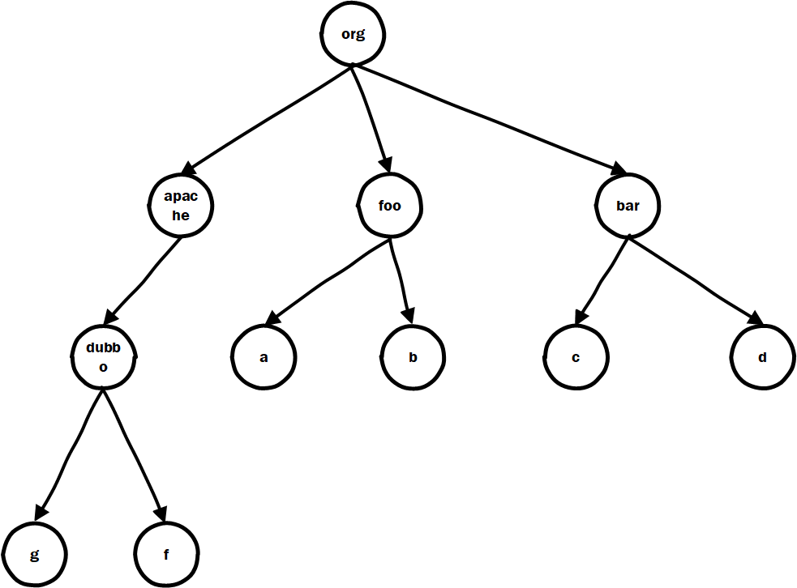

# Java fat jar split to thin jar  

# 一、问题的定义及抽象模型 

在Java中打包的时候一般有两种方式， 一种是瘦包，就是打包的时候依赖的每个第三方包都自己单独一个包，然后自己写的代码单独打一个或若干个包，这种的优点是部署的时候依赖包上传一次，后续依赖没有变动就只需要上传自己的包就可以了，相当于是一种增量部署，部署效率比较高，另一种方式就是胖包，就是不管是自己写的代码，还是第三方依赖，都一股脑儿的打到一个jar包里，因为都打到了一起，所以这个文件一般比较大，可能会上百M，所以称之为胖包，然后部署的时候就只需要上传一个jar包就可以了，但是后续即使只有一点点变动也需要重新打包上传整个胖包。

好了，介绍完胖包和瘦包的概念，现在让我们站在SCA的角度来审视一下这两种包的区别，对于瘦包而言，我们要识别是比较简单的，只需要对每个依赖包进行sha1，然后根据sha1从maven中央仓库搜索就能还原GAV，但是对于胖包就比较蛋疼了，因为多个瘦包的class都已经混在一起了，怎么把它们再分离开呢？这个问题实际上并没有特别严重的意义，只是想探索一下边界，为SCA领域的发展贡献一点微薄的推力。

假设现在有一个胖包，让我们把目录看做是一颗树，则整个胖包中的class文件大概是这个样子的：



现在我们可以把问题抽象一下，认为是我们有一颗树，树上的每个节点对应着Class上全路径类名逗号分割的一部分，书上的叶子节点就是类的名字，然后我们要对这棵树与其它的几千万颗树进行匹配，这个问题应该如何匹配呢？

正常来说这个问题几乎没办法用很小的代价去解开，比如在Spark集群上跑一个匹配算法也许能够解得开，但是我觉得这样子成本太高几乎不可行，希望能够找到一种单机就能够运行的识别算法，而不是云端提交任务的形式。

幸好我们现在找到了一个云端的API：

```text
https://search.maven.org/solrsearch/select?q=fc:org.specs.runner.JUnit&rows=20&wt=json
```

我们能够通过这个API查询一个全路径类名都在哪些GAV中出现过：

```json
{
    "responseHeader": {
        "status": 0,
        "QTime": 1621,
        "params": {
            "q": "fc:org.specs.runner.JUnit",
            "hl.snippets": "3",
            "core": "",
            "hl": "true",
            "indent": "off",
            "fl": "id,g,a,v,p,ec,timestamp,tags",
            "start": "",
            "hl.fl": "fch",
            "sort": "score desc,timestamp desc,g asc,a asc,v desc",
            "rows": "20",
            "wt": "json",
            "version": "2.2"
        }
    },
    "response": {
        // 这里的是命中的结果总数，数量级一下子被降下来了，现在不再是大海捞针了 
        "numFound": 54,
        "start": 0,
        "docs": [
            {
                "id": "org.specs:specs:1.2.3",
                "g": "org.specs",
                "a": "specs",
                "v": "1.2.3",
                "p": "jar",
                "timestamp": 1227569516000,
                "ec": [
                    "-sources.jar",
                    ".jar",
                    "-tests.jar",
                    ".pom"
                ],
                "tags": [
                    "behaviour",
                    "driven",
                    "framework",
                    "design",
                    "specs"
                ]
            },
            {
                "id": "org.specs:specs:1.2.4",
                "g": "org.specs",
                "a": "specs",
                "v": "1.2.4",
                "p": "jar",
                "timestamp": 1227569513000,
                "ec": [
                    "-sources.jar",
                    ".jar",
                    "-tests.jar",
                    ".pom"
                ],
                "tags": [
                    "behaviour",
                    "driven",
                    "framework",
                    "design",
                    "specs"
                ]
            },
            ... 
        ]
    },
    "highlighting": {
        "org.specs:specs:1.2.3": {
            "fch": [
                "<em>org</em>.<em>specs</em>.<em>runner</em>.<em>JUnit</em>"
            ]
        },
        ... 
    }
}
```

除此之外我们能够用到的还有这个页面上的其它一些API：

```text
https://central.sonatype.org/search/rest-api-guide/
```

好了，现在这个问题看起来不像是完全不可能了，那么我们应该有很多办法来做到了？如何又能少消耗资源准确度又高的进行识别呢？ 

此处需要补充一个注意点，在进行匹配的时候，我们自己的树上的同一个节点是可能会被使用多次的，也就是要被使用一次或多个，这是因为当项目的多个依赖中出现类的全路径名相同时，当它们被编译到同一个胖包的时候只会保留一个（这意味着基于类hash去匹配的方式可能会得到错误的结果，应该尽量基于类的全路径类名去匹配，同时使用hash辅助纠错验证）

# 二、大力出奇迹

一种很容易想到的暴力的解法就是对我们自己的胖包对应着的这颗树上的所有叶子节点对应的全路径类名都调用一次关联jar包查询的api，这样我们的胖包树上的每个叶子节点都能关联到零个（我们自己编写的类）或者一个（托管在Maven中央仓库中的包）或者多个（被Maven中央仓库中的多个jar包使用，这种情况比较少见，但是会存在），然后我们再想办法去掉不太可能的解，余下的结果基本就是被分离出来的瘦包了。


TODO  继续思考完善并编码实现验证 


